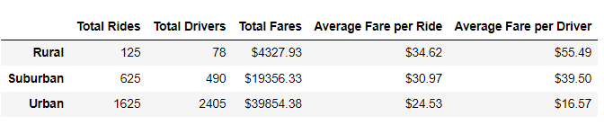
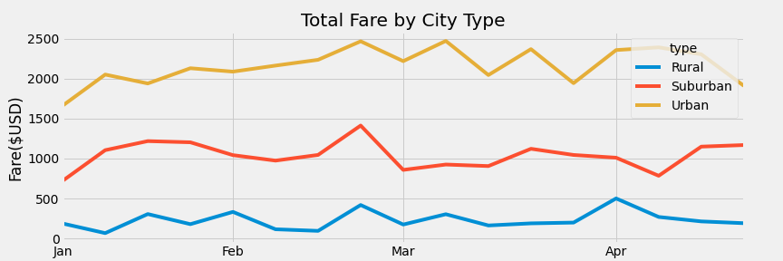

# PyBer Rideshare Analysis

## Overview of the analysis: 

In this project, we will analyze PyBer rideshare data from January to early May of 2019 with Pandas tools. We will then visualize these data with Matplotlib tools.
 

## Results: 

Not surprisingly, the Urban city type has the highest total rides, drivers, and fares, followed by the Suburban city type; while the Rural city type accounts for the least amount of the total rides, drivers, and fares. More interestingly, the rural city type saw the highest average fare per ride and rural city drivers on average earn the highest amount of fare.
  

 

When we examine the weekly total fare by city type over the first four month of 2019, we do not see any seasonality associated with these data.  Total fare by city type seems to be stable over these four months. 

 

## Summary:  
Based on this initial data analysis, we have the following recommendations:
 

* Since there are more rides than drivers in the Urban city type, we recommend increasing the marketing budget in the Urban city markets. We believe this can fully utilize the driver capacity in this type of city.
 

* Consider examining the company resources allocating to the rural city markets are proportional to their much smaller revenue contribution to PyBer.  Should PyBer reallocate these resources to markets with higher fare potentials? 

* Consider extending this data analysis to a full year to see if there is any seasonality by city type.  

* Look for cities with the highest fare growth rate, or largest fares and see if there are any success factors or best practices we can apply to other PyBer markets. 
